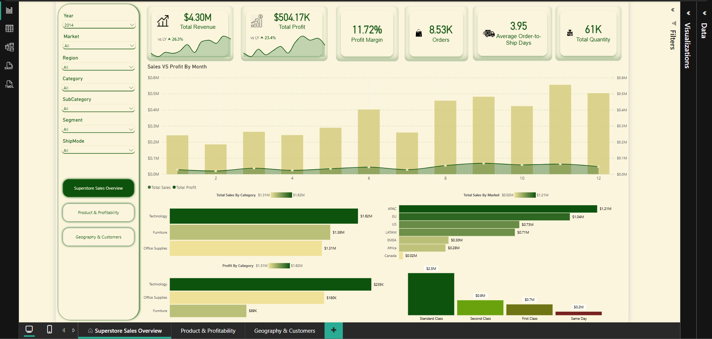
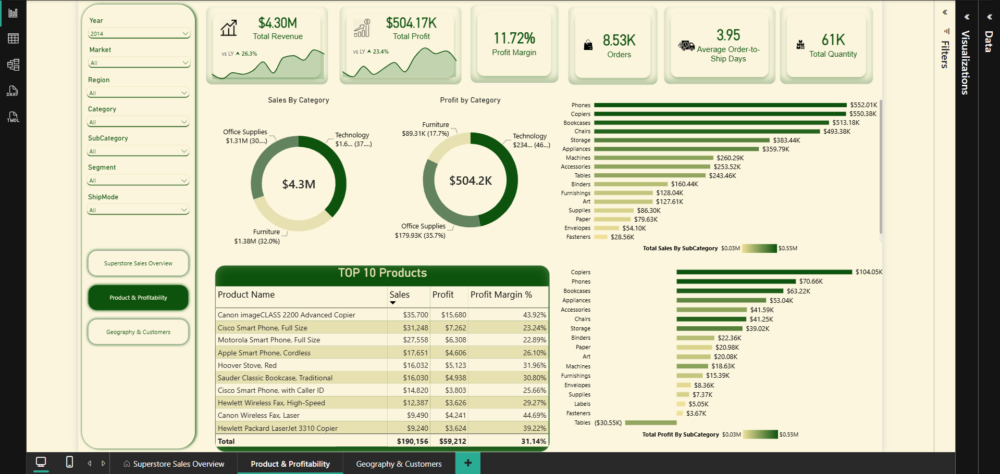
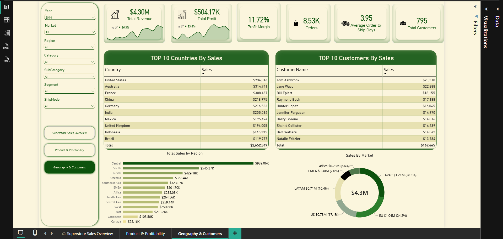
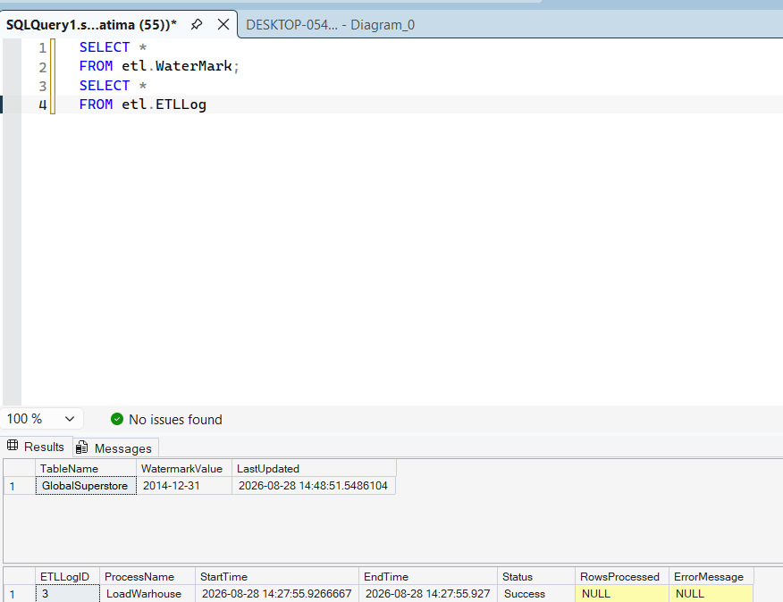
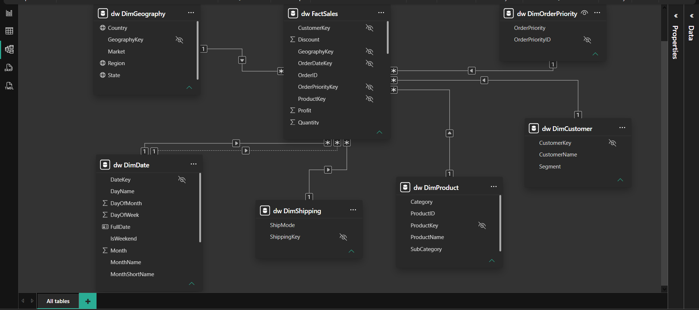
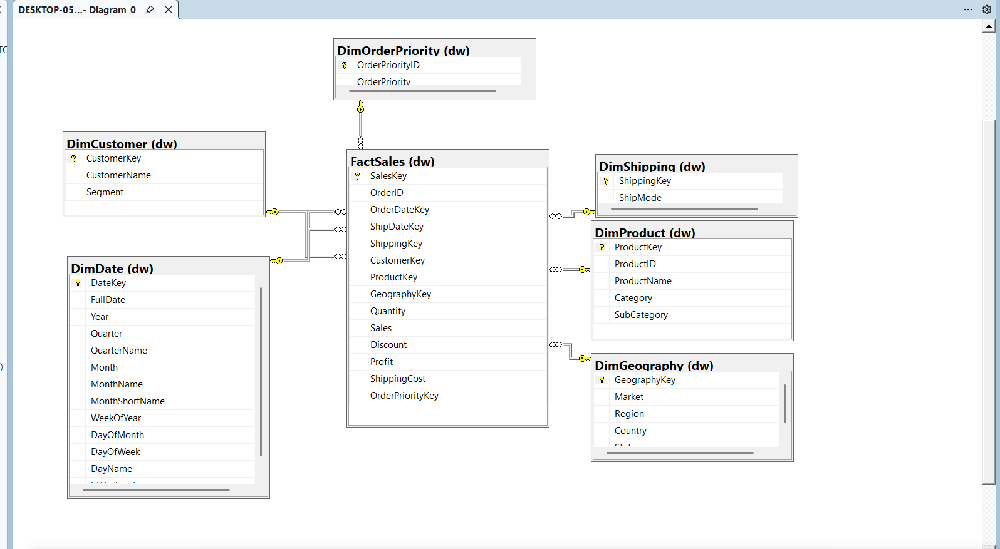

# Global Superstore — End-to-End Business Intelligence Solution

An end-to-end BI solution that transforms raw sales data into a governed analytical data warehouse and Power BI reporting layer.

⸻

## Executive Summary

This project demonstrates the design and implementation of a complete Business Intelligence pipeline using Python, SQL Server, and Power BI.

Rather than connecting Power BI directly to a raw CSV file, the solution introduces a structured data pipeline:

Raw Data → Data Quality → Staging → Advanced ETL → Dimensional Data Warehouse → Power BI Semantic Model → Business Reporting

The objective is to create a reporting solution that is reliable, maintainable, auditable, and ready for incremental data processing, rather than a one-time dashboard.

The project follows a dimensional modeling approach with a central sales fact table and supporting dimensions, a pattern well suited to analytical workloads and Power BI semantic models.

⸻

## Business Problem

Raw transactional data is not automatically suitable for reliable business reporting.

A business analyst or decision-maker needs to answer questions such as:

* How much revenue are we generating?
* How profitable are our sales?
* Which products and categories perform best?
* Which customers generate the most value?
* Which markets, countries, regions, and states drive performance?
* How does performance change over time?
* Where are discounts affecting profitability?
* How much does shipping contribute to cost?
* Can the reporting system be refreshed without rebuilding the entire warehouse?

This project addresses these requirements by separating data preparation, data integration, analytical modeling, and reporting into distinct layers.

⸻

## Solution Architecture

```                         RAW DATA
```                            │
```                            ▼
```                ┌───────────────────────┐
```                │      Python / Pandas  │
```                │                       │
```                │     profile.py        │
```                │     clean.py          │
```                │     validate.py       │
```                └───────────┬───────────┘
```                            │
```                            ▼
```                ┌───────────────────────┐
```                │     SQL STAGING       │
```                │                       │
```                │  stg.GlobalSuperstore │
```                └───────────┬───────────┘
```                            │
```                            ▼
```                ┌───────────────────────┐
```                │     ADVANCED ETL      │
```                │                       │
```                │  • Validation         │
```                │  • Watermark control  │
```                │  • Incremental load   │
```                │  • Stored procedures  │
```                │  • Transactions       │
```                │  • Error handling     │
```                │  • ETL logging        │
```                └───────────┬───────────┘
```                            │
```                            ▼
```                ┌───────────────────────┐
```                │   DATA WAREHOUSE      │
```                │                       │
```                │       DimDate         │
```                │       DimCustomer     │
```                │       DimProduct      │
```                │       DimGeography    │
```                │       DimShipping     │
```                │       DimOrderPriority│
```                │            │           │
```                │            ▼           │
```                │        FactSales       │
```                └───────────┬───────────┘
```                            │
```                            ▼
```                ┌───────────────────────┐
```                │       POWER BI        │
```                │                       │
```                │  Semantic Model       │
```                │  DAX Measures         │
```                │  Time Intelligence    │
```                │  Interactive Report   │
```                └───────────────────────┘
```
⸻


## Dashboard Preview





## Key Engineering Decisions

### Data Quality Before Warehouse Loading

The pipeline does not assume that raw data is clean.

Python is used to profile, clean, and validate the source before it reaches SQL Server.

#### profile.py

Investigates:

* Dataset structure
* Data types
* Missing values
* Duplicate records
* Unique values
* Numeric distributions
* Date ranges
* Potential anomalies

#### clean.py

Performs controlled preparation such as:

* Column-name standardization
* Text normalization
* Date conversion
* Numeric conversion
* Duplicate removal
* Clean dataset generation

#### validate.py

Acts as a quality gate before loading data into SQL Server.

Validation includes:

* Required-column checks
* Missing critical values
* Date validity
* Quantity validation
* Sales validation
* Duplicate/business-key checks

This creates a clear separation between data preparation and warehouse transformation.

⸻

### SQL Server Staging Layer

The cleaned data is loaded into:

stg.GlobalSuperstore

The staging layer provides a controlled boundary between the external source and the warehouse.

This makes the pipeline easier to validate, troubleshoot, and rerun without directly transforming the raw source into production warehouse tables.

⸻

###  Dimensional Data Warehouse

The warehouse uses a star-schema design.

Dimensions

dw.DimDate
dw.DimCustomer
dw.DimProduct
dw.DimGeography
dw.DimShipping
dw.DimOrderPriority

Fact

dw.FactSales

The fact table contains measurable business events such as:

* Sales
* Quantity
* Discount
* Profit
* Shipping Cost

while dimensions provide the analytical context needed to slice and aggregate those measures.

A star schema is designed specifically for analytical workloads such as filtering, grouping, and summarization, and is a recommended foundation for Power BI semantic models. 

⸻

### Surrogate Keys and Dimension Lookups

The warehouse separates business identifiers from warehouse surrogate keys.

During fact loading, the ETL resolves source business keys into warehouse dimension keys.

```
For example:

```Customer_ID     │
```     ▼
```DimCustomer
```     │
```     ▼
```CustomerKey
```     │
```     ▼
```FactSales
```
The same approach is used for products, geography, shipping, order priority, and dates.

This keeps the analytical model independent from the raw source identifiers and supports scalable dimensional modeling.

⸻

### Advanced ETL Pipeline

The warehouse is not loaded through a single full-refresh operation.

The ETL layer contains:

- etl.Watermark
- etl.ETLLog

and stored procedures responsible for:

* Staging validation
* Dimension loading
* Fact loading
* Incremental processing
* Duplicate protection
* Surrogate-key resolution
* Transaction management
* Error handling
* ETL execution logging

The pipeline processes dimensions before facts so the required dimension keys are available during fact loading.

⸻

### Incremental Loading



A watermark is used to identify the previously processed boundary.

Conceptually:

```Previous Watermark
```        │
```        ▼
```   Identify New Data
```        │
```        ▼
```   Load Dimensions
```        │
```        ▼
```      Load Facts
```        │
```        ▼
``` Successful Transaction
```        │
```        ▼
``` Update Watermark

This avoids repeatedly processing the entire dataset when only a new incremental range needs to be processed.

The design follows the general watermark-based incremental loading pattern documented by Microsoft.

⸻

### Reliability and Failure Handling

The ETL pipeline uses SQL transactions and error handling to prevent partially completed warehouse loads.

The process follows:

```BEGIN TRANSACTION
```        │
```        ├── Validate
```        ├── Load Dimensions
```        ├── Load Facts
```        ├── Update Watermark
```        │
```        ▼
```     COMMIT
```
If a critical failure occurs:

```ERROR
```  │
```  ▼
```ROLLBACK
```  │
```  ▼
```ETL LOG
```
This is important because a failed ETL process should not leave the warehouse in an inconsistent state.

⸻

### ETL Observability

The project includes an ETL logging mechanism that records information such as:

* Process name
* Start time
* End time
* Status
* Rows processed
* Error message

This provides a basic operational audit trail and makes troubleshooting easier.

⸻

## Power BI Analytics Layer

The warehouse feeds a Power BI semantic model designed around business analysis rather than raw-source reporting.

The report provides analysis across:

### Sales

* Total Revenue
* Sales trends
* Sales by market
* Sales by country
* Sales by region
* Sales by product category

### Profitability

* Total Profit
* Profit trends
* Profit by category
* Profit by geography
* Profitability impact of discounts

### Customers

* Customer performance
* Top customers
* Customer segmentation

### Products

* Product performance
* Category performance
* Sub-category performance

### Operations

* Shipping modes
* Shipping costs
* Order priorities

### Time Intelligence

The model includes DAX time-intelligence calculations for comparing performance across periods.

Examples include:

* Month-to-date
* Year-to-date
* Previous-period comparisons
* Period-over-period analysis


## Data Model




The model separates:

- Facts

What happened?

from:

- Dimensions

Who, what, where, when, and how?

This makes the model easier to understand and consume in Power BI.

⸻

## Evidence & Validation

The value of this project is not only the dashboard.

The solution provides evidence at multiple stages of the pipeline.

### Data quality evidence

`profile.py
`     ↓
`Missing-value analysis
`Duplicate analysis
`Type analysis
`Date-range analysis

### Pipeline evidence

`etl.ETLLog
`     ↓
Execution status
Rows processed
Execution timestamps
Errors

### Incremental-load evidence

The pipeline can be executed again after the initial load without blindly duplicating previously processed records.

The watermark tracks the processed boundary.

### Warehouse evidence

- SELECT COUNT(*) FROM dw.FactSales;

and dimension validation queries confirm that the warehouse contains the expected analytical structures.

### Business validation

Power BI measures are reconciled against warehouse-level aggregations to verify that report numbers are consistent with the underlying data.

⸻

## Data Quality Findings

An important part of this project was investigating the source instead of assuming the source was perfect.

For example, the analysis identified that:

* Product IDs are not necessarily a simple one-to-one representation of product descriptions in the source.
* Date formatting required normalization before reliable conversion.
* The source contains repeated order/product combinations because the dataset represents sales at a transaction/order-line level.
* Dimension cardinality must therefore be validated before defining warehouse keys and fact-table grain.

These findings influenced the warehouse and ETL design instead of being ignored.

⸻

## Project Value

This project demonstrates more than the ability to create a Power BI dashboard.

It demonstrates the ability to build the data foundation behind the dashboard.

### From a BI Developer perspective

The solution demonstrates:

Data Profiling
      ↓
Data Quality
      ↓
ETL / ELT
      ↓
SQL Server
      ↓
Data Warehouse
      ↓
Dimensional Modeling
      ↓
Incremental Processing
      ↓
Data Validation
      ↓
Power BI Semantic Model
      ↓
Business Insights

### Business value

The architecture provides:

* More reliable reporting
* Consistent business definitions
* Reusable warehouse structures
* Controlled data quality
* Incremental processing
* Better maintainability
* Traceable ETL execution
* Separation between source data and reporting
* A scalable foundation for additional analytics

The project therefore focuses on building a BI system, not simply producing a visualization.

⸻

## Technology Stack

| Layer | Technology | Purpose |
|---|---|---|
| Source | CSV | Raw transactional data |
| Data Preparation | Python | Profiling, cleaning, validation |
| Data Processing | Pandas | Tabular data transformation |
| Database | SQL Server | Staging and warehouse |
| ETL | T-SQL | Transformation and loading |
| Warehouse | Star Schema | Analytical data model |
| Semantic Layer | Power BI | Business analysis |
| Calculations | DAX | Measures and time intelligence |
| Version Control | Git | Source control |
| Repository | GitHub | Project documentation and code |
⸻

## Repository Structure
```
Global-Superstore-BI/
│
├── README.md
├── .gitignore
│
├── python/
│   ├── 01_profile.py
│   ├── 02_clean.py
│   └── 03_validate.py
│
├── sql/
│   ├── staging/
│   ├── dimensions/
│   ├── fact/
│   └── etl/
│
├── docs/
│   └── dashboard.png
│   └── architecture.md
│   └── data_dictionary.md
│   └── requirements.md
│
└── powerbi/
    └── SuperstoreBi1.pbix
```
⸻

## Project Workflow

To reproduce the solution:

1. Profile the source

python profile.py

2. Clean the source

python clean.py

3. Validate the cleaned data

python validate.py

4. Load the validated data into SQL staging

stg.GlobalSuperstore

5. Execute the warehouse ETL

EXEC etl.LoadWarehouse;

6. Validate the ETL

SELECT *
FROM etl.ETLLog
ORDER BY ETLLogID DESC;

7. Validate the watermark

SELECT *
FROM etl.Watermark;

8. Connect Power BI to the warehouse

The Power BI model consumes the dimensional warehouse rather than the raw CSV.

⸻

## Limitations & Production Considerations

This project intentionally uses a public/static dataset to demonstrate BI engineering concepts.

A production implementation would additionally consider:

* Source-system change tracking
* Reliable LastModifiedDate or CDC
* Automated scheduling/orchestration
* Secrets management
* CI/CD
* Automated testing
* Data lineage
* Monitoring and alerting
* Role-based access control
* Deployment environments
* Cloud infrastructure
* Larger-volume performance testing

The current watermark implementation demonstrates the incremental ETL pattern, while production systems would require a source-side change-detection mechanism appropriate to the actual source system.

⸻

## Future Enhancements

Potential extensions include:

* Microsoft Fabric implementation
* Automated pipeline orchestration
* CI/CD
* Automated data-quality tests
* Power BI Service deployment
* Row-level security
* Incremental refresh
* Additional business domains
* Production-grade monitoring
* Slowly Changing Dimensions with source-system change detection

⸻

## Author

Mohamad Ayoub
[LinkedIn](https://www.linkedin.com/in/mhmdayoub) · [GitHub](https://github.com/MohamadAyoub-hub)

⸻

## Disclaimer

This project uses the Global Superstore dataset for educational and portfolio purposes.

The architecture, transformations, warehouse model, ETL processes, validation logic, and Power BI reporting layer were designed and implemented as part of this project.